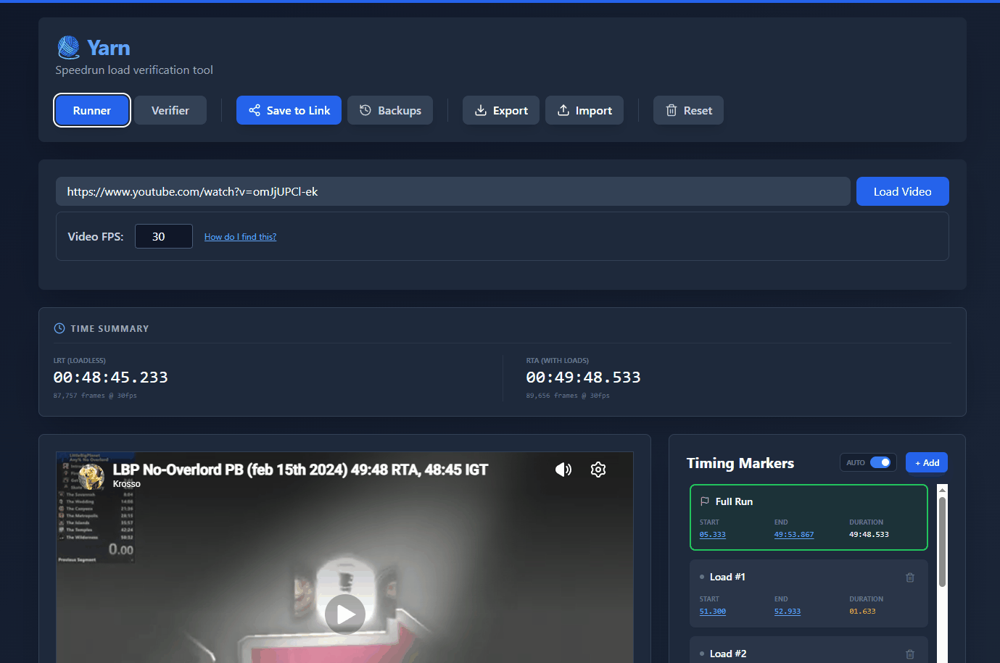

# Yarn
[](https://github.com/KR0SS0/yarn/actions/workflows/ci.yml)

**Link → [kr0ss0.github.io/yarn](https://KR0SS0.github.io/yarn/)**

**Example demo → [kr0ss0.github.io/yarn/?run=0fHWBK0fM1foRJHaNz3Q](https://kr0ss0.github.io/yarn/?run=0fHWBK0fM1foRJHaNz3Q)**

**Example demo with warnings → [kr0ss0.github.io/yarn?run=xPJAXkKMiuDC5Gxvjye1](https://kr0ss0.github.io/yarn?run=xPJAXkKMiuDC5Gxvjye1)**

A frame-accurate load timing tool for speedrunners and verifiers, built around YouTube's iframe API.



---

## The problem

In speedrunning, records are often judged on **Load Removed Time (LRT)**, the clock pauses during loading screens so that hardware speed doesn't determine the winner. The current workflow creates unnecessary double work:

1. A **Runner** watches their run and manually marks every load start and end.
2. A **Verifier** receives the video and re-times the entire thing from scratch to confirm the runner wasn't mistaken.

For long runs this can take an hour of redundant work per submission, and introduces human error on both sides.

## How Yarn fixes it

Yarn separates the process into two modes:

- **Runner mode**: mark load start/end directly against a YouTube video, frame by frame. Export as a shareable cloud link or JSON file.
- **Verifier mode**: import the runner's markers and jump directly to each frame checkpoint. One click per load instead of re-timing from scratch.

The timing data is fully transparent. Every community member can inspect the exact frames used, which removes bias and makes disputes resolvable without rewatching entire runs.

## Keyboard shortcuts

Mirrors standard YouTube shortcuts where possible.

| Key | Action |
|---|---|
| `Space` / `K` | Play / Pause |
| `,` / `.` | Step backward / forward one frame |
| `J` / `L` | Seek −10s / +10s |
| `←` / `→` | Seek −5s / +5s |
| `X` / `Z` | Cycle to next / previous verification checkpoint |
| `M` | Toggle mute |
| `F` | Toggle fullscreen |

---

## Local development

```bash
git clone https://github.com/KR0SS0/yarn.git
cd yarn
npm install
cp .env.example .env.local   # add your Firebase credentials
npm start
```

See `.env.example` for the required environment variables.
